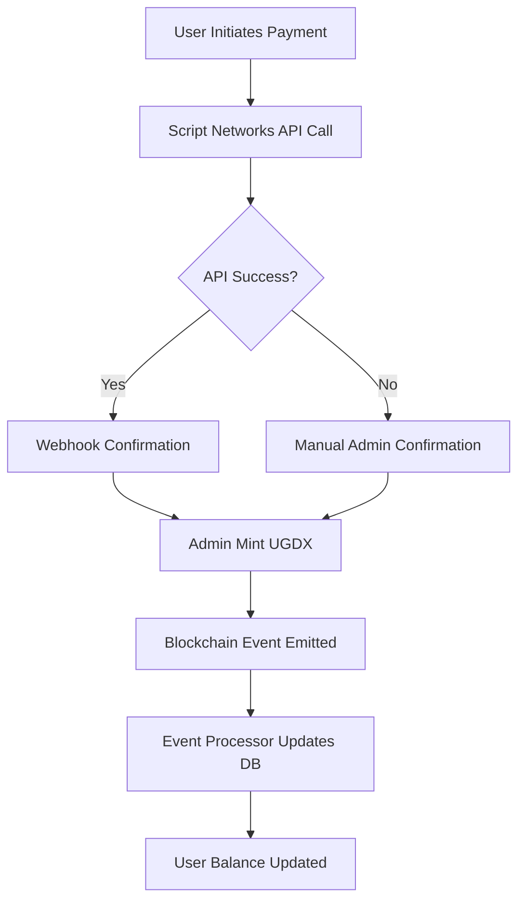
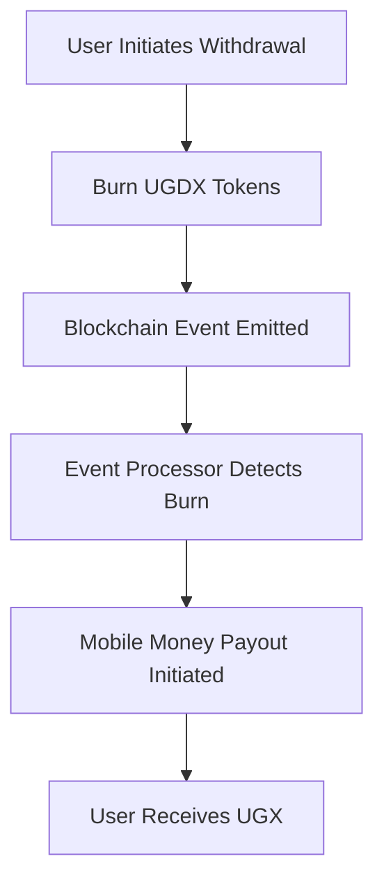

# 👽⛓️‍💥 Hermes Backend API - Advanced Blockchain Payment System

> **Enterprise-grade blockchain payment backend with hybrid event processing, mobile money integration, and advanced security enforcement.**

##  **Treasury & Fee System**

### 🔐 **Security & Permissions**

### 🔑 **User Roles**
1. **User**: Can swap, burn, and view their own transactions via meta-transactions
2. **Advanced**: Can swap, burn,fund their wallet with MATIC and view their own transactions
2. **Admin**: Can manage users, view all transactions, and access basic admin functions
3. **HyperAdmin**: Full system access including fee management and contract administration

### 🛡️ **Security Features**
- Role-based access control (RBAC)
- JWT authentication with refresh tokens
- IP whitelisting for admin endpoints
- Suspicious activity monitoring
- Rate limiting and cooldown periods

### 💰 **Fee Collection**
- **Automatic Fee Tracking**: All swap and burn fees are tracked in real-time
- **Fee Distribution**: Fees are automatically distributed to the configured `feeRecipient`
- **Fee Types**:
  - `swap`: 0.5% fee on USDT to UGDX swaps
  - `burn`: 0.25% fee on UGDX burns for mobile money withdrawals

### 📊 **Admin Treasury Dashboard**
- View total fees collected by type
- Monitor recent fee collections with user details
- Track bridge reserves and minted supply
- Export fee reports for accounting

### 🔄 **Redemption Flow**
1. User initiates withdrawal (burns UGDX via meta-tx)
2. System collects burn fee (0.25%)
3. Mobile money payout is processed
4. All events are logged for reconciliation

## 🌟 **Key Features**

### 🔗 **Blockchain Integration**
- **Bridge Contract**: Full integration with UGDX Bridge smart contract
- **Meta-Transaction Support**: Users can burn UGDX without holding MATIC
- **Event Processing**: Real-time tracking of all on-chain events
- **Oracle Integration**: Hybrid pricing with fallback to manual rates
- **Hybrid Event Processing**: WebSocket + Block Polling + Startup Replay for 100% reliability
- **Smart Contract Integration**: UGDX token, Bridge contract, and Oracle system
- **Meta-Transaction Support**: Gasless transactions for seamless UX
- **Real-time Event Monitoring**: Automatic database synchronization with on-chain events

### 💳 **Mobile Money Integration**
- **Script Networks API**: Automated payment processing with webhook callbacks
- **Manual Admin Fallback**: Robust backup system for payment confirmations
- **Multi-Provider Support**: Extensible architecture for various mobile money providers
- **Real-time Status Updates**: Live payment tracking and notifications

### 🛡️ **Enterprise Security System**
- **Database-Backed Enforcement**: Persistent security violations and account locking
- **Progressive Risk Management**: LOW → MEDIUM → HIGH → CRITICAL escalation
- **Advanced Pattern Detection**: Algorithm-powered suspicious activity monitoring
- **Rate Limiting & Cooldowns**: Multi-layered protection against abuse
- **Admin Security Dashboard**: Real-time monitoring and user management

### 📊 **Advanced Analytics & Monitoring**
- **Comprehensive Logging**: Timestamped events with job IDs and flow tracking
- **Security Analytics**: Violation trends, risk distribution, and threat intelligence
- **Performance Monitoring**: Oracle rate jobs, event processing metrics
- **Audit Trails**: Complete forensic tracking for compliance

## 🏗️ **Architecture Overview**

```
┌─────────────────┐    ┌─────────────────┐    ┌─────────────────┐
│   Frontend      │    │   Mobile App    │    │   Admin Panel   │
│   (React)   │    │   (React Native)│    │   (React Dashboard)   │
└─────────┬───────┘    └─────────┬───────┘    └─────────┬───────┘
          │                      │                      │
          └──────────────────────┼──────────────────────┘
                                 │
                    ┌─────────────▼─────────────┐
                    │     Hermes Backend API    │
                    │   (Express.js + Prisma)   │
                    └─────────────┬─────────────┘
                                 │
          ┌──────────────────────┼──────────────────────┐
          │                      │                      │
┌─────────▼───────┐    ┌─────────▼───────┐    ┌─────────▼───────┐
│   Blockchain    │    │   Database      │    │  External APIs  │
│   (Ethereum)    │    │  (PostgreSQL)   │    │ (Script Networks)│
│   - UGDX Token  │    │  - Users        │    │ - Mobile Money  │
│   - Bridge      │    │  - Transactions │    │ - Webhooks      │
│   - Oracle      │    │  - Security     │    │ - Payments      │
└─────────────────┘    └─────────────────┘    └─────────────────┘
```

## 🔐 **Security Features**

### **Multi-Layered Protection**
- **Rate Limiting**: Progressive penalties with automatic escalation
- **Pattern Detection**: Advanced algorithms for suspicious activity
- **Account Locking**: Database-persistent enforcement with risk levels
- **Admin Override**: Secure unlock capabilities with audit trails

### **Security Levels**
- **Maximum Security**: Admin routes (5 req/15min, 10s cooldown)
- **High Security**: Financial routes (10 req/5min, 5s cooldown)
- **Standard Security**: General endpoints (30 req/1min)

### **Risk Management**
```javascript
LOW Risk     → 3+ violations → 2-hour lock   → MEDIUM Risk
MEDIUM Risk  → 5+ violations → 24-hour lock  → HIGH Risk  
HIGH Risk    → 7+ violations → 72-hour lock  → CRITICAL Risk
CRITICAL Risk → Any violation → 1-week lock  → Manual review
```

## 💰 **Payment Flow Architecture**

### **Mobile Money → UGDX Flow**


### **UGDX → Mobile Money Flow**


## 🔧 **API Endpoints**

### **Authentication**
- `POST /auth/register` - User registration with wallet creation
- `POST /auth/login` - JWT authentication
- `POST /auth/verify-otp` - OTP verification
- `POST /auth/refresh` - Token refresh

### **Transactions**
- `POST /transactions/mint` - Buy UGDX with mobile money
- `POST /transactions/redeem` - Convert UGDX to mobile money
- `POST /transactions/send` - Send UGDX to phone/address
- `GET /transactions/history` - Transaction history
- `GET /rates/current` - Current exchange rates

### **Admin Operations**
- `GET /admin/payments/pending` - Pending payment confirmations
- `POST /admin/payments/confirm` - Confirm payment manually
- `POST /admin/payments/reject` - Reject payment
- `GET /admin/payments/history` - Payment history
- `GET /admin/payments/treasury` - Get onchain treasury overview and fee collections
- `GET /admin/payments/balance/:userId` - Get user's on-chain UGDX balance

### **Security Monitoring**
- `GET /security/dashboard` - Security analytics dashboard
- `GET /security/flagged` - Locked/flagged users
- `POST /security/unflag` - Unlock user account
- `GET /security/status` - Current security status

### **System Monitoring**
- `GET /monitor/health` - System health check
- `GET /bridge/status` - Bridge status
- `GET /reserves/status` - Reserves status
- `POST /oracle/update-rate` - Manual override to set exchange rate from external API
- `GET /oracle/health` - Oracle health check
- `POST /oracle/on` - Enable oracle pricing mode
- `POST /oracle/off` - Disable oracle pricing mode


## 📊 **Database Schema**

### **Core Models**
- **User**: Authentication, wallet, security status
- **Transaction**: Payment records and status tracking
- **MobileMoneyJob**: Mobile money payment processing
- **SecurityViolation**: Security event audit trail
- **EventLog**: Blockchain event processing history


## 🎯 **Advanced Features**

### **Hybrid Event Processing**
- **WebSocket Listeners**: Real-time event detection
- **Block Polling**: Backup mechanism for missed events
- **Startup Replay**: Historical event synchronization
- **Duplicate Prevention**: Robust event deduplication

### **Meta-Transaction Support**
- **Gasless UX**: Users don't need ETH for gas
- **EIP-2771 Compatible**: Standard meta-transaction implementation
- **Gas Credit System**: Internal gas management
- **Signature Validation**: Secure off-chain signing

### **Oracle Integration**
- **Exchange Rate Updates**: Automated UGX/USD rate synchronization
- **Circuit Breaker**: Safety mechanisms for rate volatility
- **Manual Override**: Admin control for emergency situations
- **Rate History**: Historical rate tracking and analytics

